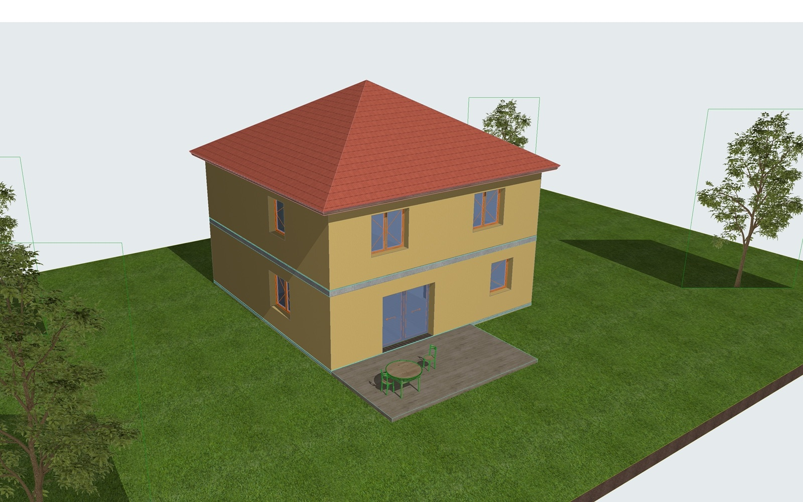
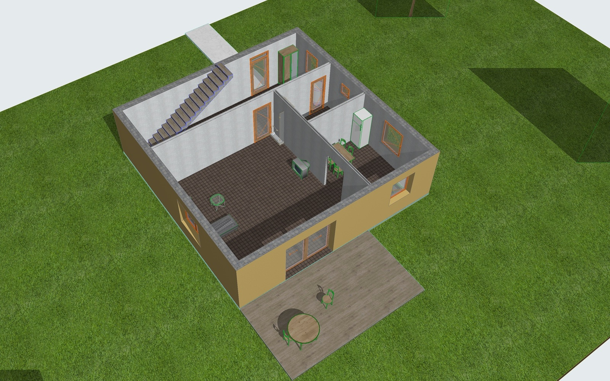
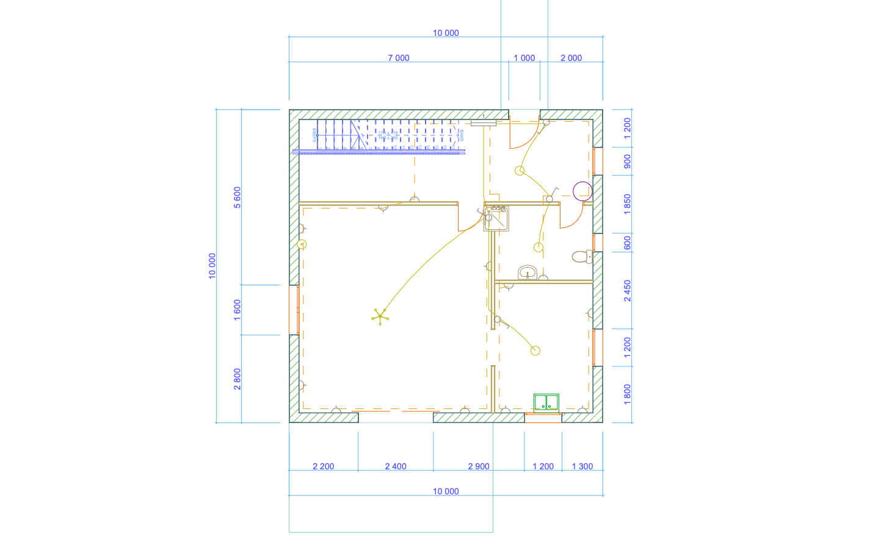
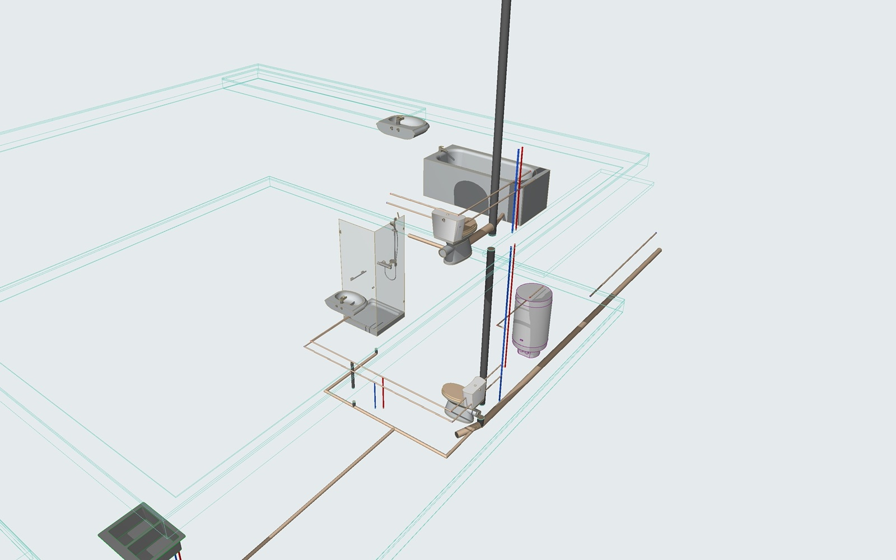

# Archicad MCP Connector

[](https://github.com/davidharutyunyan/archicad-mcp-connector/actions/workflows/ci.yml)
[](LICENSE)

**An MCP server that gives Claude full read/write control of Graphisoft Archicad 26** — model, draft, annotate, query,
document, export and manage BIM data in a live project, and *see* the result through captured views.

* **~260 tools in 21 families**: stories, attributes, walls, columns, beams, slabs, roofs, shells, meshes, morphs, curtain
  walls, stairs, railings, zones, doors/windows/skylights/openings, objects/lamps, custom GDL parts, 2D drafting,
  dimensions, labels, views & 3D, image capture, sections/elevations/details/worksheets, layouts & drawings, PDF / IFC /
  DXF / OBJ / STL / module export, publishing, hotlinks, properties, classifications, IFC data, issues & BCF, favorites,
  tool defaults, Teamwork, revisions, undo/redo, project save/open — plus raw access to every official JSON API command.
* **Built for an LLM**: meters & degrees everywhere, batched calls (one undo step each), per-item results, strict input
  validation that names wrong fields, actionable error messages, localized-name lookups and `capture_view` so Claude can
  verify its work visually.
* **Verified live** against Archicad 26 (build 5002): 574 unit tests + a live regression of 413 checks across all
  families (`npm run test:live`).

> **Claude: read [`docs/CLAUDE_GUIDE.md`](docs/CLAUDE_GUIDE.md)** (also returned by the `get_connector_guide` tool) before
> building or editing anything. It contains the conventions, the working loop, recipes and the known limits.

## Example: a two-storey house, built and documented by Claude

From two prompts, Claude modelled a 2 × 100 m² house with interiors on a 1000 m² plot, then added electrical and
plumbing plans and published a 17-sheet plan book. Full walkthrough: **[examples/two-story-house](examples/two-story-house/)**.

| | |
|---|---|
|  |  |
|  |  |

---

## How it works

```
Claude ──MCP (stdio)──▶ archicad-connector (Node.js, src/)
                            │  HTTP JSON  →  http://127.0.0.1:19723  (Archicad's JSON API, ports 19723-19744)
                            ▼
                     Archicad 26 ── official API.* commands (elements, properties, classifications, navigator, layouts...)
                                └─ API.ExecuteAddOnCommand → "ClaudeConnector" add-on (C++, addon/)
                                     create/modify every element type, views & images, exports, GDL, Teamwork, BCF ...
```

* The **MCP server** (`src/`) exposes typed tools (zod schemas → JSON Schema) and talks to Archicad over HTTP.
* The **Claude Connector add-on** (`addon/`, C++ against the Archicad 26 API DevKit) implements ~170 JSON commands the
  official API lacks. Without the add-on only the official-API tools work (`archicad_status` tells you which).

## Requirements

| | |
|---|---|
| Archicad | **26** (tested: 26.0.0 build 5002, Russian localization, macOS Intel). Any localization works. |
| OS | macOS (Intel or Apple Silicon). The MCP server itself is cross-platform; the add-on build scripts are macOS-only (see *Windows*). |
| Node.js | **≥ 20** |
| Add-on build | Xcode Command Line Tools (`xcode-select --install`), `cmake` and `ninja` (`brew install cmake ninja`), Python 3 |
| Graphisoft Developer ID | Required for the add-on to load in licensed Archicad — see [Add-on ID (MDID)](#add-on-id-mdid). |

## Installation

```bash
git clone https://github.com/davidharutyunyan/archicad-mcp-connector.git && cd archicad-mcp-connector
npm install
npm run build                      # MCP server -> dist/
```

### 1. Build and install the add-on

```bash
bash scripts/fetch-devkit.sh       # downloads Graphisoft's official Archicad 26 API DevKit (≈170 MB) into .devkit/
# put your add-on ID into addon/mdid.local.cmake first (next section)
bash scripts/archicad.sh stop      # Archicad must be closed while the add-on is registered
bash scripts/build-addon.sh        # -> addon/build/ClaudeConnector.bundle
bash scripts/install-addon.sh      # copies it to ~/Library/ClaudeConnector/AC26/ and registers it in the Add-On Manager
bash scripts/archicad.sh start     # starts Archicad with a fresh project from the default template
```

`scripts/dev-cycle.sh` does build → stop → install → start in one go. Check the result with
`bash scripts/archicad.sh status` (or the `archicad_status` tool): `commandCount` ≈ 170.

### Add-on ID (MDID)

Licensed Archicad loads only add-ons whose **MDID** (Developer ID + Add-On ID) was issued by Graphisoft; otherwise the
Add-On Manager shows *"The authenticity of this add-on cannot be verified. Please contact the distributor."*

1. Sign in at [archicadapi.graphisoft.com](https://archicadapi.graphisoft.com/) with your Graphisoft ID and register as a
   developer → you get a **Developer ID**.
2. In your profile open [Add-ons](https://archicadapi.graphisoft.com/profile/add-ons), create "Claude Connector" → **Local ID**.
3. Create `addon/mdid.local.cmake` (git-ignored):
   ```cmake
   set (AC_MDID_DEVELOPER <your developer id>)
   set (AC_MDID_LOCAL     <your add-on local id>)
   ```
4. `bash scripts/dev-cycle.sh`.

*Local testing only:* `addon/mdid.local.cmake` may temporarily borrow the public MDID of the open-source
[Tapir](https://github.com/ENZYME-APD/tapir-archicad-automation) add-on (it is in Tapir's own repository). Two add-ons cannot share
an MDID, so `install-addon.sh` then disables Tapir in the Add-On Manager (`python3 scripts/addon_manager.py enable-tapir`
restores it; your Archicad preferences are backed up to `~/Library/ClaudeConnector/prefs-backups/`). Never distribute a
build with a borrowed ID.

### 2. Connect Claude

**Claude Code**

```bash
claude mcp add archicad -s user -- node /absolute/path/archicad-mcp-connector/dist/index.js
```

**Claude Desktop** — `~/Library/Application Support/Claude/claude_desktop_config.json`:

```json
{
  "mcpServers": {
    "archicad": {
      "command": "/absolute/path/to/node",
      "args": ["/absolute/path/archicad-mcp-connector/dist/index.js"],
      "env": { "ARCHICAD_TOOLSETS": "all" }
    }
  }
}
```

Use an absolute `node` path (e.g. `~/.nvm/versions/node/v24.x/bin/node`) — GUI apps do not see your shell's PATH.
Then open (or create) a project in Archicad — **the JSON API only listens while a project is open** — and ask Claude to
run `archicad_status`.

## Configuration

| Variable | Default | Meaning |
|---|---|---|
| `ARCHICAD_PORT` | auto | Fixed JSON API port. Default: scan 19723-19744 and prefer an instance with the add-on. |
| `ARCHICAD_HOST` | `127.0.0.1` | Archicad host. |
| `ARCHICAD_TIMEOUT_MS` | `120000` | Per-request timeout (renders/exports pass their own longer timeouts). |
| `ARCHICAD_TOOLSETS` | `all` | Which tool families to load (fewer tools = less context). Comma list of families and presets, `-name` excludes. Presets: `minimal` (views + query), `modeling`, `documentation`, `data`. Families: `project, stories, attributes, element-query, element-edit, walls, columns-beams, slabs-roofs, openings, objects-library, zones, drafting, dimensions, complex-elements, views, documentation, properties, collaboration, official` (`system` and `elements` are always loaded). Example: `modeling,dimensions` or `all,-collaboration,-official`. |
| `ODA_FILE_CONVERTER` | – | Path to the ODA File Converter executable; enables real `.dwg` output in `export_dwg` (DXF works without it). |

Several Archicad instances? `archicad_status` lists them; `select_archicad_instance {port}` switches.

## Using it (for Claude and for you)

The full guide is **[docs/CLAUDE_GUIDE.md](docs/CLAUDE_GUIDE.md)**. The essentials:

1. **Orient → discover → plan → build in batches → verify → document.** Start with `archicad_status`,
   `get_project_info`, `get_stories`; look up names with `get_attributes` / `search_library_parts`.
2. **Units** are meters and degrees; elevations are relative to the element's home story.
3. **Walls**: `referenceLine: "Outside"` = the outer face, body to the *right* of begin→end — draw exterior walls clockwise.
   **Slabs**: `level` is the top surface. **Openings**: host wall GUID + distance from the wall begin to the centre.
4. **Look** at the result: `capture_view {"threeD": {"mode": "axonometric", "azimuth": 225, "altitude": 35}}`,
   `capture_view {"view": {"window": "FloorPlan", "story": 0}, "zoom": {"mode": "fit"}}`.
5. Everything is one undo step per call; `undo` / `redo` exist.

Example prompts:
* *"Build a 10×8 m single-storey brick house with a hip roof, two rooms, a door and three windows, then show me a 3D view."*
* *"List all walls on the ground floor with their composites and total wall area; change the exterior ones to <composite>."*
* *"Create sections through the building, place the ground floor plan and a section on a new A3 layout and export it as PDF."*
* *"Add a 'Fire rating' property to all doors, set EI30 on the ones in the corridor and export IFC."*
* *"Write a GDL object for a planter box with a parametric height and place four of them along the terrace."*
* *"Add electrical and plumbing plans for both floors plus a 3D plumbing schematic, and publish the whole plan book
  (architecture, ЭО, ВК sheets with filled title blocks) as one PDF."* (verified live on a two-storey house: 17 sheets)

## Tools

Complete generated reference with every field: **[docs/TOOLS.md](docs/TOOLS.md)** (`npm run docs:tools` regenerates it).

| Family | Highlights |
|---|---|
| system | `archicad_status`, `select_archicad_instance`, `get_connector_guide`, `list_addon_commands`, `execute_json_api_command`, `execute_addon_command` |
| elements | `create_elements`, `get_element_details`, `modify_elements`, `get_supported_element_types` (generic, all types) |
| project | project info & Project Info fields, save / save as (pln, pla), open / new / close, preferences (units...), geo location, rebuild, undo / redo, quit |
| stories | get / create / modify / delete stories, set current story |
| attributes | get all 16 attribute types; create layers, layer combinations, composites, building materials, surfaces, fills, line types, zone categories, profiles; duplicate / modify / delete; pens; layer states; apply layer combination |
| walls, columns-beams, slabs-roofs | walls (straight, curved, trapezoid, slanted, composite, profiled), segmented columns & beams (holes, tapering), slabs, single/multi-plane roofs, shells (extruded / revolved / ruled), meshes |
| openings | windows & doors in walls, skylights in roofs/shells, Opening tool (slab/wall holes) |
| objects-library | objects, lamps, library search & details & scripts, **create GDL library parts**, GDL parameters get/set, swap library part, library list/add/remove/reload |
| zones | automatic (by point) and manual zones with stamps & areas, relocation, `update_zones` |
| complex-elements | morphs (box, extrusion, arbitrary mesh), curtain walls (grids, panels, frames), stairs, railings |
| drafting, dimensions | lines, arcs, circles, polylines, splines, hatches, texts (multi-style), labels (associative), hotspots, pictures; linear / level / radial / angle dimensions, `dimension_walls` |
| element-query, element-edit | find/filter, counts, quantities, relations, sub-elements, selection, 2D/3D geometry; move / copy / rotate / mirror / elevate / resize / delete, copy to stories, group, lock, draw order, trim, merge, solid operations |
| views | windows & navigation, zoom, 3D camera/axonometry, show in 3D, **capture_view** (images), render, sections / elevations / interior elevations / details / worksheets, view settings |
| documentation | databases, layouts' drawings: place / modify / delete / update, publish, export PDF / IFC / DXF(+DWG) / OBJ / STL / GSM / module, merge, hotlinks |
| properties | property groups & definitions CRUD (incl. enums), values by name, attribute property values, IFC data & properties, classification systems & items CRUD, XML import |
| collaboration | Teamwork status/send/receive/reserve/release, issues (comments, attachments) + BCF import/export, favorites, tool defaults, revisions |
| official | typed wrappers of the official JSON API: element lists/types/bounding boxes/components, classifications, navigator tree & items, layouts, attribute folders, publisher sets, pen tables, profile previews |

## Limitations (Archicad 26 API)

* No native undo API — `undo`/`redo` trigger Archicad's Edit menu (macOS) and act on the whole undo history.
* No DWG writer in the API — `export_dwg` writes DXF (R12) and converts to DWG only with the ODA File Converter.
* Zones: two automatic zones cannot share a room; a zone's reference point cannot be moved in place (the connector re-creates it).
* Base lines of existing stairs, railings and curtain walls cannot be edited (re-create them); spline geometry is read-only after creation.
* Openings cannot be placed in polygonal walls; an opening's host cannot be changed.
* `render_view` depends on CineRender; if Cineware crashes on the machine it returns a blank image (flagged in the result) — `capture_view` still works.
* Project open/close/quit end the API connection until a project is open again.
* GDL dictionary parameters are not accessible; library part creation cannot check GDL syntax.
* MEP Modeler parts (pipes, ducts, cable trays) cannot be created: model pipes as circular beams/columns on the MEP layers
  and draw wiring in 2D (recipe in the guide, §4.9).
* A Layout Book subset's numbering cannot be changed after creation: create subsets with the wanted custom ID.

## Troubleshooting

| Symptom | Fix |
|---|---|
| `No running Archicad found` | Open or create a project (the API listens only while a project is open). |
| Add-on commands "not available" | `archicad_status` → `connectorAddOn`. Check the Add-On Manager: *authenticity cannot be verified* = missing/invalid MDID (see above). `~/Library/Logs/ClaudeConnector.log` shows whether the add-on initialized. |
| Calls time out | A modal dialog is open in Archicad (answer it), or a long render/export is running. |
| Archicad starts slowly after a crash | It recovers the autosave first (can take minutes). Crash reports: `~/Library/Logs/DiagnosticReports/Archicad-*.ips`. |
| "Unrecognized key(s)" | Inputs are strict — fix the field name the error mentions. |
| Wrong names | Attribute/library names are localized — copy them from `get_attributes` / `search_library_parts`. |

## Development

```
src/                     MCP server (TypeScript): archicad/client.ts, tools/<family>.ts, guide.ts
addon/Src/Core/          add-on framework: command registry, JSON helpers, element adapters, polygons, library parts
addon/Src/Commands/      one file (or prefix group) per family
scripts/                 fetch-devkit, build/install add-on, archicad.sh start|stop|restart|status, dev-cycle, addon_manager.py,
                         mcp-call.ts (call any tool from the shell), gen-tool-reference.ts, sig.ts
test/unit/               vitest with a fake Archicad (npm test)
test/live/               live suites against a running Archicad (npm run test:live — restarts Archicad on a fresh project)
docs/                    CLAUDE_GUIDE.md, TOOLS.md (generated), DEVELOPING.md
examples/                worked examples with screenshots (two-story-house)
.github/workflows/       CI
```

* Call tools exactly like Claude does: `npx tsx scripts/mcp-call.ts create_walls '{"walls":[...]}'`.
* **CI** (GitHub Actions, every push and pull request): typecheck, build and unit tests on Linux (Node 20 / 22 / 24)
  and macOS, a check that `docs/TOOLS.md` is up to date, and a universal (arm64 + x86_64) build of the add-on
  against the public Archicad 26 DevKit. The live suites need a running Archicad and stay local.
* Architecture, conventions, Core API and patterns for adding commands/tools: [docs/DEVELOPING.md](docs/DEVELOPING.md).
* **Windows**: the MCP server runs unchanged; the add-on sources are portable C++ but the CMake file and scripts are
  set up for macOS — port `addon/CMakeLists.txt` following the DevKit examples' `WIN32` branches and build with MSVC.

## License

MIT — see [LICENSE](LICENSE). Archicad and the Archicad API DevKit are © Graphisoft SE; the DevKit is downloaded from
Graphisoft's official repository and is not redistributed here.
