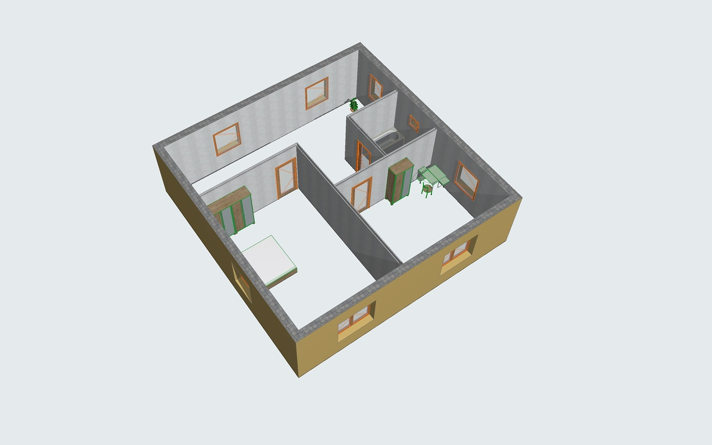
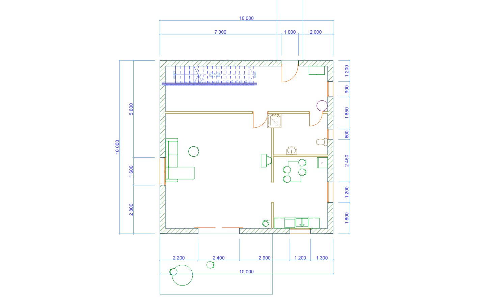
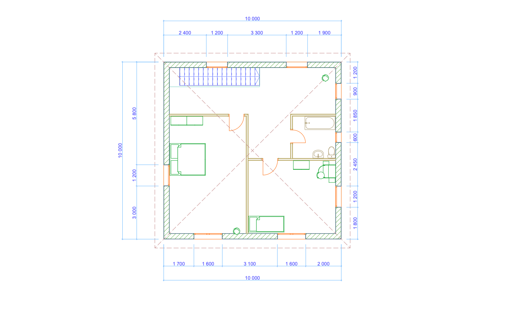
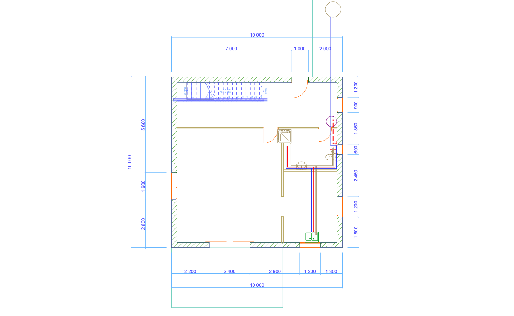

# Example: a two-storey house, from an empty project to a full plan book

Everything on this page was produced by Claude through this connector, in a running **Archicad 26** (Russian
localization). No manual modelling was done in Archicad. The screenshots were taken with `capture_view`, with
text layers hidden so that no localized wording shows.

## The prompts

1. *"Create a two-story house on a 1000 m² plot, each story 100 m², with the interior and everything."*
2. *"Is it possible to do plumbing and electrical wiring plans as well, and generate the whole project plan book?"*

## What was built

* **Site**: a 40 × 25 m plot (terrain mesh, boundary, trees, a path from the street and a terrace).
* **House**: 10 × 10 m, two stories (ground floor ±0.000, upper floor +3.000).
  * Load-bearing exterior walls, partitions, floor slabs and a hip roof.
  * A stair with a railing; doors and windows.
  * Zones with areas, and furniture plus sanitary fixtures in every room.
* **Electrical**: a distribution board, sockets, switches, lights and junction boxes. The lighting and socket
  circuits are drawn as polylines with one pen per circuit, and each floor has a legend.
* **Plumbing**:
  * Cold water, hot water and sewer pipes, modelled as circular beams with a fall on the sewer lines, plus risers
    (circular columns) and a water heater.
  * Each system has its own pen, and there is a 3D schematic view. (The Archicad 26 API cannot create MEP Modeler
    parts; see the guide, §4.9.)
* **Documentation**: saved views and layer combinations per discipline, dimensions and labels.
  * A 17-sheet Layout Book: architecture (plans, section, site plan, elevations, perspective), electrical (ЭО) and
    plumbing (ВК), with filled-in title blocks.
  * Published as one multi-page PDF with `publish_publisher_set`.

## Screenshots

| | |
|---|---|
|  |  |
| Exterior perspective from the south-west | 3D plumbing schematic: fixtures, risers, cold / hot water and sewer pipes |
|  |  |
| Ground floor: living room, kitchen-dining, bathroom, hall with the stair, terrace | Upper floor: bedrooms, bathroom, hall |
|  |  |
| Ground floor plan with dimensions (1:100) | Upper floor plan |
|  |  |
| Electrical plan, ground floor: board, lights, switches, sockets and circuits | Plumbing plan, ground floor: water supply (blue / red) and sewer |

## How it was done (main tool calls)

```text
get_connector_guide · get_project_info · get_stories · get_attributes · search_library_parts
create_meshes (terrain) · create_polylines (plot boundary)
create_walls (exterior clockwise, then partitions) · create_slabs · create_roofs · create_stairs · create_railings
create_doors · create_windows · create_zones · create_objects (furniture, fixtures, trees)
capture_view (3D and plans, after every step) · get_element_quantities
create_beams / create_columns (pipes and risers) · create_polylines / create_texts / create_labels (wiring, legends)
create_layer_combinations · set_view_settings (scale, zoom, layers per saved view) · dimension_walls · create_dimensions
create_layout · create_layout_subset · place_drawing · set_project_info_fields · publish_publisher_set · save_project_as (.pla)
```

Names of attributes and library parts are localized (here: Russian). Claude looked them up with `get_attributes` /
`search_library_parts` instead of guessing; the guide ([docs/CLAUDE_GUIDE.md](../../docs/CLAUDE_GUIDE.md)) describes
the workflow and the Archicad 26 limits.
